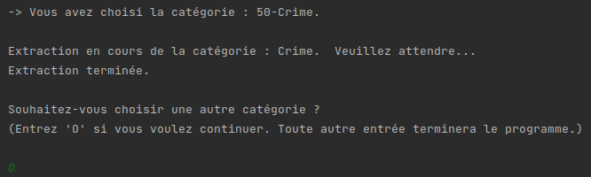

# Web-scrapping-Books
## Description
Ce programme permet d'extraire des informations d'ouvrages provenant du site 
[http://books.toscrape.com](http://books.toscrape.com).
Les informations recueillies relatives à chaque ouvrage sont : 
1) l'adresse url,
2) le code produit universel (upc),
3) le titre, 
4) le prix toutes taxes comprises, 
5) le prix hors taxes, 
6) le nombre d'unités disponibles, 
7) la description du produit, 
8) la catégorie, 
9) la note utilisateur, 
10) l'adresse url de l'image de couverture.

Concernant les catégories d'ouvrages (Thriller, Fiction, etc.) :
- Il est possible de choisir de quelle catégorie d'ouvrages on souhaite extraire les informations. 
- Il est possible d'extraire les informations des ouvrages de toutes les catégories d'un coup.

Concernant le rendu des données, pour chaque catégorie, est créé :
- un fichier au format .csv qui répertorie les informations de tous les ouvrages de sa catégorie.
- les images de couvertures de tous les ouvrages de sa catégorie.


## Procédure d'installation
Il est recommandé d'installer un environnement virtuel tel que *virtualenv*. Pour ce faire, suivez les instructions 
ci-dessous :

- S'il ne l'est pas déjà, installez le package *virtualenv* :
```sh
pip install virtualenv
```

- Créez un environnement de travail dans votre répertoire courant et activez-le :
```sh
virtualenv venv
$ source venv/bin/activate
```

- Installez les packages nécessaires au bon fonctionnement du programme à l'aide du fichier requirements.txt :
```sh
pip install -r requirements.txt
```

## Utilisation du programme
### Lancement du programme
Pour démarrer le programme, utilisez la commande suivante :
```sh
python3 main.py
```

### En cours d'utilisation
- L'id et le nom de toutes les catégories d'ouvrages du [site](http://books.toscrape.com) s'affichent dans la console.
- Il faut écrire dans la console le nombre correspondant à la catégorie choisie. 
    - Pour extraire les informations de toutes les catégories d'un coup, entrez le nombre 0. Attention, cette procédure 
peut prendre beaucoup de temps.
    - Dans l'exemple ci-dessous, nous avons choisi d'extraire les informations de la catégorie 50, ie. *Crime*.


- Une fois les informations extraites il est possible :
  - de renouveler l'opération en inscrivant le mot 'Oui' (cf. image ci-dessous).
  - de fermer le programme en inscrivant tout autre chose dans la console \(la touche *Entrée* suffit également à 
elle seule).



## Retrouver les données extraites
- Un dossier intitulé *data* est créé dans le répertoire courant. 
- Celui-ci contient des sous-dossiers propres à chaque catégorie et identifiables selon l'id et le nom de la catégorie.
- Ces sous-dossiers contiennent un fichier .csv contenant les informations de tous les ouvrages de la catégorie. 
De plus, sont également stockées les images de couverture de chaque ouvrage.


- Les noms des fichiers images suivent la convention suivante : id d'ouvrage unique présent dans l'url de la page 
produit suivi du titre de l'ouvrage.